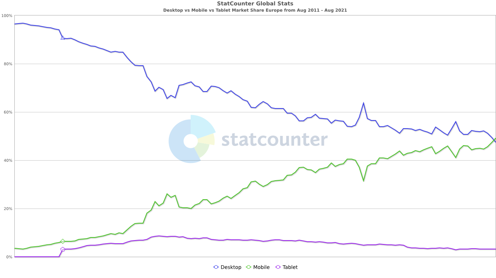

# Neuronet
Hackathon Project in partnership with Trust In Soda. Deadline Monday 13th September 2022 @ 3pm.

## Contents
<ul>
    <li>
        <a href="#Introduction"><strong>Introduction</strong></a>
    </li>
    <li>
        <a href="#Collaborators"><strong>Collaborators</strong></a>
    </li>
    <li>
        <a href="#UX"><strong>UX</strong></a>               
    </li>
    <li>
        <a href="#Technologies"><strong>Technologies</strong></a>
    </li>
    <li>
        <a href="#Features"><strong>Features</strong></a>
    </li>
    <li>
        <a href="#Testing"><strong>Testing</strong></a>   
    </li>
    <li>
        <a href="#Deployment"><strong>Deployment</strong></a>
    </li>
    <li>
       <a href="#Credits"><strong>Credits</strong></a> 
    </li>
    <li>
        <a href="#Screenshots"><strong>Screenshots</strong></a>
    </li>
</ul>

## Introduction

Neuronet is a way to bring neurodiverse individuals into the light. It is a way for businesses to fill posts from a talent pool that may otherwise go unnoticed or disregarded. Most people are neurotypical, meaning that the brain functions and processes information in the way society expects. However it is estimated that around 1 in 7 people (more than 15% of people in the UK) are neurodivergent, meaning that the brain functions, learns and processes information differently. Highly-focused concentration, careful attention to detail and out of the box thinking are some of the skills often associated with autism, and as such it would be a huge loss to have these incredible individuals go underappreciated. Neuronet seeks to connect employers with these applicants in a way that is both comfortable and empathetic to the needs of those who may not be able to connect in the more conventional ways.

### Demo
(Insert image or gif of website in action here)

## Collaborators
<ul>
    <li>Raevynna El Messaoudi</li>
    <li>Kevin O'Carroll</li>
    <li>Ryan Thomas</li>
    <li>Carrie</li>
    <li>Deanna Sale</li>
</ul>
Project Facilitator: Tim Nelson

## UX
### Strategy
#### Vision
Neuronet is a specialised multifunctional application catering to the needs of neurodiverse individuals, as well as give the opportunity to companies to employ individuals from an under-represented talent pool. It will give neurodiverse individuals the opporunity to showcase their talents, strengths and weaknesses in a non-judgmental environment, by allowing them to complete an online resume and disclose the unique skillsets they have, as well as diclose the environments and situations that will allow them to communicate and work to the best of their abilities. The website will be highly accessible and take into consideration the requirement for an environment that meets the needs of these individuals through the use of colour schemes, high levels of user intuitiveness and giving the choice of varying means of communication with potential employers. It will allow companies to advertise current open roles via a job board, and arrange the interview process for applicants. The companies will be able to disclose the types of interviews that would be available such as video-call, e-mail, phone-call or face-to-face with stipulations such as only 1 or 2 interviewers or the interviewee may bring a friend or family member with them as support. Our overall vision is to have neurodiverse individuals to not be at a disadvantage because of their unique needs. 

#### Aims
<ol>
    <li>To be a safe non-judgemental environment for neurodiverse individuals to showcase their talents</li>
    <li>To be a highly user intuitive application for users with neurodiverse tendancies</li>
    <li>To be an environment where companies can advertise their open job roles on a job-board to be inclusive of individuals who are neurodiverse</li>
    <li>To be a web application for companies and prospective applicants to use during the job application process where application/interview and work environments can be discussed in advance to suit the needs of the neurodiverse individual</li>
    <li>To be highly accessible in terms of colour scheme and contrast to cater for the needs of those with sensory needs</li>
    <li>To be a learning tool for companies to ensure they are using best practices to ensure they are catering for the needs of neurodiverse individuals</li>
    <li>To enable individuals with conditions such as social anxiety to be more comfortable in highly stressful situations which occur in the job application and interview processes</li>
</ol>

#### Target Audience
We have two main target audiences:
<ul>
    <li>Individuals who are neurodiverse to include those with conditions such as: Autism, anxiety, depression, bipolar, BDD, OCD, phobias, dyslexia, tourettes and many many more.</li>
    <li>Companies that want to improve their employee diversity by including individuals that have unique skills that arise from conditions mentioned above. </li>
</ul>
The application could also be aimed at recruiters that are more aware of the need to have neurodiverse individuals 'in the workplace'.

#### User Stories
##### As a new and returning neurodiverse user I want to:
<ol>
    <li>Know the purpose of the website as soon as I navigate to the home/landing page</li>
    <li>Navigate the website quickly and effectively</li>
    <li>Find everything in the website that I need to find with ease</li>
    <li>Have visual aids and obvious calls to action throughout the site to aid in user intuitiveness</li>
    <li>Have an up to date job board so I can see which jobs are available to apply for</li>
    <li>Be able to log in to the website and create my personal profile for prospective employers to view</li>
    <li>Ensure that my profile is viewable ONLY to prospective employers and not other users</li>
    <li>Feel safe and understood despite any difficulties my condition may cause with no potential for judgement or discrimination</li>
    <li>See the company ideals and values that I am applying for to ensure I will be a good fit</li>
    <li>Be able to organise any interview process by describing my needs for the company within the application on my profile</li>
</ol>

##### As a new and returning potential employer/company I want to:
<ol>
    <li>Know the purpose of the website as soon as I navigate to the home/landing page</li>
    <li>Navigate the website quickly and effectively</li>
    <li>Find everything in the website that I need to find with ease</li>
    <li>Be able to log in to the website and create a profile for my business/company for potential employees to view</li>
    <li>Be able to post jobs to an easily accessible job board for potential employees to view</li>
    <li>Ensure that our business profile is viewable to prospective employees only and not to other businesses</li>
    <li>Increase our workforce diversity by employing more individuals with a Neurodiverse nature</li>
    <li>Have an easy and intuitive application to be able to contact applicants and discuss their needs for the interview process</li>
    <li>Highlight the adaptations that we are able to put in place to make the interview and worplace more accessible</li>
</ol>

##### As the developers we want to:
<ol>
    <li>Create an environment where neurodiverse individuals are comfortable and are not disadvantaged for thinking differently to others</li>
    <li>Provide a platform for businesses who are lacking in diversity to have a way to find unique neurodiverse individuals to fill roles</li>
</ol>

#### Feasibility vs Importance
<table>
    <tr>
        <th>Opportunity/Feature</th>
        <th>Feasibility/Viability (score out of 5)</th>
        <th>Level of Importance (score out of 5)</th>
        <th>In or out?</th>
    </tr>
    <tr>
        <td>Obvious role of the website demonstrated with hero image/video and/or capture text</td>
        <td>5</td>
        <td>5</td>
        <td>In</td>
    </tr>
    <tr>
        <td>Simple design with straightforward navigation to make it easier for the user to understand where to find information</td>
        <td>5</td>
        <td>5</td>
        <td>In</td>
    </tr>
    <tr>
        <td>Up-to-date job adverts on a job-board viewable by prospective employees</td>
        <td>4</td>
        <td>3</td>
        <td>In</td>
    </tr>
    <tr>
        <td>A Fully accessible website able to be experienced by customers with visual and sensory impairments</td>
        <td>4</td>
        <td>5</td>
        <td>In</td>
    </tr>
    <tr>
        <td>A logon system for potential employees to create a secure profile viewable by prospective employers</td>
        <td>4</td>
        <td>4</td>
        <td>In</td>
    </tr>
    <tr>
        <td>A logon system for business/companies to advertise jobs in their workplace and to showcase their company values</td>
        <td>4</td>
        <td>3</td>
        <td>In</td>
    </tr>
    <tr>
        <td>A straightforward form for prospective employees to complete enabling them to showcase their talents and skills while disclosing their weaknesses</td>
        <td>5</td>
        <td>4</td>
        <td>In</td>
    </tr>
    <tr>
        <td>A way for website users with sensory difficulties to choose the colours of the website they are most comfortable with</td>
        <td>4</td>
        <td>2</td>
        <td>Maybe In</td>
    </tr>
    <tr>
        <td></td>
        <td>Average Viability x number of features:  31</td>
        <td>Sum of Importance:  29</td>
        <td></td>
    </tr>
</table>
As we can see from the table above, the viability is higher than the importance, which is good because that means most of the features are able to be implemented, however we must be careful not to implemnt features that would be unneccessary for the web application and decrease the usability of the site from a Neurodiverse peron's perspective. We must also be careful to stay within the scope of our own coding limitations - implementing features that we have little experience of could cause a high liklihood of bugs and errors in the web application which would in turn reduce the potential of a positive user experience.
The table above has been plotted into a graph (below) to easily visualise the features that will be implemented into the web application and which ones won't be:
<ul>
    <li>The features in the pink section will be implemented</li>
    <li>The features in the grey section could be implemented at a later date but aren't necessary right now</li>
    <li>The features in the turquoise section will not be implemented as it would be unwise to focus on these features until a later date</li>
</ul>
 

### Scope
Due to the pitfalls of developing a website based on the MVP (Minimum Viable Product) model such as lack of user experience and enjoyment due to a lack of content, it is sometimes more beneficial to develop a website based on MMP (Minimum Marketable Product). However due to the sprint nature and the time constraints we have for this project (a total of 4 full days from brief to presentation) we have to create the website based on MVP. This will allow the basic functions of the website to be implemented and have the website be usable but not neccessarily complete with all of the discussed features in place. One of the main advantages of creating an MVP is we can gauge the reaction of users before implementing more features, to ensure that the overall necessity for the web application is there, meaning less time is potentially wasted on a product that isn't going to be used by our target audience.  

By using the MVP model we will:
<ul>
    <li>Create a clear website with enough content for the users to establish the usefulness of the web application</li>
    <li>Result in a website with medium levels of UX, but still enough to be user friendly for our target audiences</li>
    <li>Meet the needs of the business and user on the most basic levels</li>
</ul>
While following the MVP model, to meet the user and business goals, our website will include:
<ul>
    <li>A self-designed logo on all pages as assurance to the customer we are a trusted-business with our own identity</li>
    <li>A nav-bar on all pages to be able to navigate to separate pages on the website</li>
    <li>Links to associalted social media on all pages within the footer</li>
    <li>sign up forms for users to be able to create personal profiles</li>
    <li>Form for prospective employees to fill in as an alternative to a CV to show their talents and skills</li>
    <li>A job board for prospective employers to post to, to be able to advertise current open roles in their business</li>
</ul>

### Structure
**PROVISIONAL**
We have chosen to carry out a non-linear method of design for this website application as it consists of multiple pages which might not necessarily be viewed in a particular order as each page has a different role to play. By having multiple pages we can separate information into logical sections to make it easier for the user to find what they are looking for particularly for the users that may find it more difficult to navigate websites. The navigation bar at the top of all of the pages allows the user to easily navigate to the page of the website they are most interested in. There are also certain pages (such as on the jobs board) that have their own internal navigation sections as each advertised job will take the user to the full job advertisement when they interact with the 'job card'.
  
<strong>On index.html</strong>: Separate sign in/sign up buttons for business owners and prospective employees? Each button brings up separate modal? If user doesn't have an account - link in modal to take to specific sign up page?  
<strong>On signupbusiness.html</strong>: Form to fill in to choose username, email, password   
<strong>On signupuser.html</strong>: Form to fill in to choose username, email, password   
<strong>On profile.html</strong>: Form to fill in for user to state details (name, DOB, address etc etc), qualifications, talents, strengths, weaknesses, talk about themselves etc.  
<strong>On company.html</strong>: Form to fill in for business to fill in business name, values, location etc etc. and a separate form to fill for advertising job posts - job title, job role, person spec, location etc.  
<strong>On board.html</strong>: Page of jobs advertised by companies which are linked to the full job advert  
<strong>On jobadvert.html</strong>: Full job advert including job title, job role, person spec, location etc. (everything the business owner inputted into the form in their profile page)  
<strong>On contactus.html</strong>: Form to fill in to contact Neuronet for any user problems and tech support  
<strong>On 404.html</strong>: Neuronet logo, appologies, redirect to index.html link 

### Skeleton
The wireframes for the <em>Neuronet</em> website application were made with the <a href="" target="_blank">(Insert app name here)</a>, they can be found by viewing the images below. As the trend for mobile browser usage has been on an upwards trend for the last 10 years in Europe culminating in a crossover of hardware usage in the recent year, it could be assumed that these trends will continue and result in users opting more and more for a mobile browser instead of a desktop. 
 
Due to this assumed continuing trend we have chosen to take a mobile-first approch to the design process. A Mobile-First Approach refers to the practice of designing and/or developing an online experience for mobile before designing for desktop web or any other device. Taking a Mobile First approach aims to reverse the workflow of designing for desktop and scaling down the design for mobile afterwards. Wireframes were made for mobile and desktop devices to ensure user friendly UX was employed throughout. 

(Insert Wireframes here)

The wireframes were created during the website application's initial desgin process, as such there are changes between the layout of the wireframes and the final layout/design of the finished website. 

### Surface
#### Typography
As recommended in various literature, we have chosen to use sans-serif fonts throughout the website as these are more user friendly for users with specialised sensory needs. We used <a href="https://fonts.google.com/" target="_blank">Google Fonts</a> to find the typography that we wanted to use for the website. 
 

**PROVISIONAL** 
The fonts we used for the text body of the website was 'Lato' as this font is easy to read which is needed when there is large amounts of information to be read and absorbed by users, it has a modern feel, and is a popular font for many websites. The back-up font is 'Sans-Serif' just in case the font import link fails. The font used for headings is 'Roboto' this is also a very popular font recommended by many websites that cater to the needs of individuals with neurodivesity.

#### Colour Scheme
We have tried to make the colour scheme as user friendly as possible to cater to the needs of individuals with possible sensory overload disorders such as autism. After carrying out some research it was found that toned down blues and greens were the most favourable for these types of individuals, as well as neutral colours such as greys and beiges. 

#### Icons
The <em>Neuronet</em> logo was handmade by the team "Accessibility All-Stars" during the website development process. We felt this was a very important aspect to get done quickly as this would give us a feel for how the website would take shape. The logo itself is based on the neurodiversity logo which is a rainbow coloured infinity symbol, the neural pathways within the loop were added to symbolise the "Neuro" and to a point also "net" of the Neuronet brand name as this gives the users an inclination as to the purpose of the website. The brand name and tag line underneath the sympol were added to the symbol to again help the user identify the purpose of the website and to encourage inclusion by acknowledging everybody's ability to think differently and that this is a huge benefit to workplaces that are striving to be more diverse.

#### Images (if used)
#### Videos (if used)

## Technologies
### Languages
<ol>
    <li><a href="https://en.wikipedia.org/wiki/HTML5" target="_blank">HTML</a></li>
    <li><a href="https://en.wikipedia.org/wiki/CSS" target="_blank">CSS</a></li>
    <li><a href="https://en.wikipedia.org/wiki/JavaScript" target="_blank">JavaScript</a></li>
    <li><a href="https://en.wikipedia.org/wiki/Python_(programming_language)" target="_blank">Python</a></li>
    <li><a href="https://www.markdownguide.org/" target="_blank">Markdown</a></li>
    <li><a href="https://en.wikipedia.org/wiki/Bash_(Unix_shell)" target="_blank">Bash</a></li>
</ol>   

### Version Control
<ol>
    <li><a href="https://github.com/" target="_blank">Git & Github</a></li>
    <li><a href="https://www.gitpod.io/" target="_blank">Gitpod & VS Code</a></li>
</ol>

### Applications
<ol>
    <li><a href="https://#/" target="_blank">Wireframe software</a></li>
    <li><a href="https://slack.com/intl/en-gb/" target="_blank">Slack</a></li>
    <li><a href="https://hackathon.codeinstitute.net/" target="_blank">Hackathon App</a></li>
</ol>

### Frameworks & Libraries & Programmes
<ol>  
    <li><a href="https://en.wikipedia.org/wiki/Django_(web_framework)" target="_blank">Django</a></li>
    <li><a href="https://developer.chrome.com/docs/devtools/" target="_blank">Chrome Developer Tools</a></li>
    <li><a href="http://colormind.io/" target="_blank">Colormind.io</a></li>
    <li><a href="https://fonts.google.com/" target="_blank">Google Fonts</a></li>
    <li><a href="https://favicon.io/" target="_blank">Favicon.io</a></li>
    <li><a href="https://validator.w3.org/" target="_blank">W3C Markup Validation Service</a></li>
    <li><a href="https://jigsaw.w3.org/css-validator/" target="_blank">Jigsaw W3C CSS Validation Service</a></li>
    <li><a href="https://jshint.com/" target="_blank">JSHint JavaScript Code Quality Tool</a></li>  
    <li><a href="http://pep8online.com/checkresult" target="_blank">PEP8 ONLINE</a></li>
    <li><a href="http://ami.responsivedesign.is/" target="_blank">Am I responsive</a></li>
    <li><a href="https://wave.webaim.org/" target="_blank">WAVE Web Accessibility Evaluation Tool</a></li>  
</ol>  

## Features
### Implemented Features
### Features Left to Implement

## Testing
### Functionality
### Compatibility
### User Testing Stories
### Code Validation
### Issues Found During Deployment
### Accessibility
### Performance Testing

## Deployment
### Project Creation
### Project Deployment

## Credits
### Code
### Content
### Images
### Video
### Acknowledgements

## Screenshots

## References
